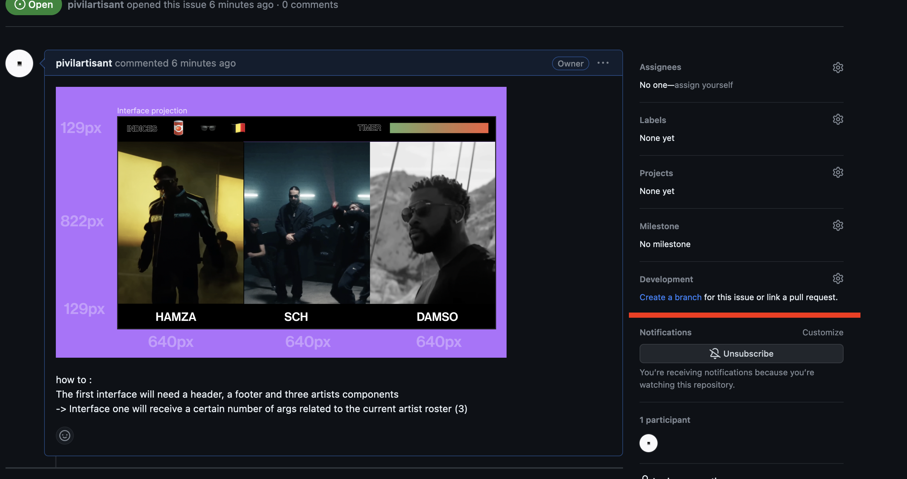
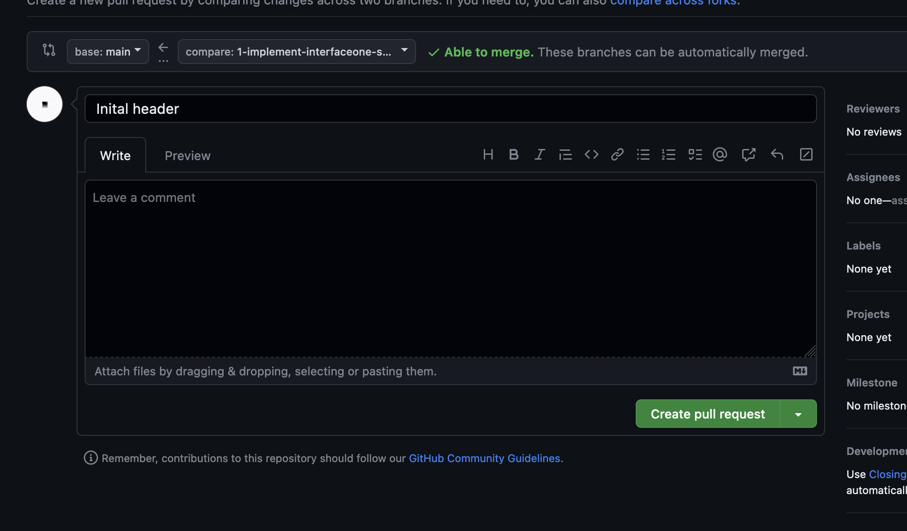
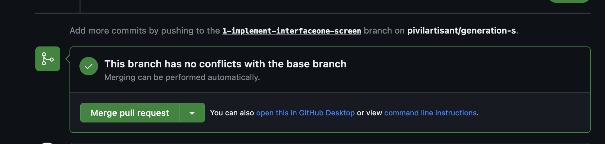

# generation-s

### 1. Introduction

Generation(s) is an opensource interactive application for musical exploration.
### 2. Installation

Clone the repo if you want to collaborate or download the .ZIP file to experiment in a local setting.

Run pip import cv2 in python_tracker to install the OpenCV library. (You ahve to have Python3 installed on your machine)

Run npm install in : /root + /server +  /client to install all the dependencies. (You have to have Node.js installed on your machine)
### 3. Contributing

This application is currenlty under development. If you want to contribute feel free to create an issue and corresponding branch. You also contribute to the documentation by adding to this README.md file which is a good first issue.

By default this repo uses React, but since it's basically html you can creat a simple div like this :

`export function MyDiv () {
    return (
        

            <h1>My Div</h1>
        

    )
}`

to style import the css file in the same folder and add the class to the div like this :

`import './myDiv.css'`

and add the class to the div like this :

`export function MyDiv () {
    return (
        

            <h1>My Div</h1>
        

    )
}`

### 4. How to use git hub ? 
 In the folder you want to clone the repo using this command (must have git installed on your machine):

 `git clone https://github.com/pivilartisant/generation-s.git` 

After creating an issue on the repo, create a branch in git hub (see picture) :

after that in your code editor (VS Code, Atom, Sublime Text, etc...) open the terminal and type :
` git checkout <branch-name> `
to switch to the branch you just created.

To add code changes to the branch you have to stage the changes using the command :
` git add . `

then commit the changes using the command :
` git commit -m "your commit message" `

then push the changes to the branch using the command :
` git push `

After that you can create a pull request on the repo (see picture) :

than follow the instructions and wait for the pull request to be merged.

=> If you struggle with github & open source collaboration we recommend the very good : 

https://github.com/pivilartisant/open-pixel-art